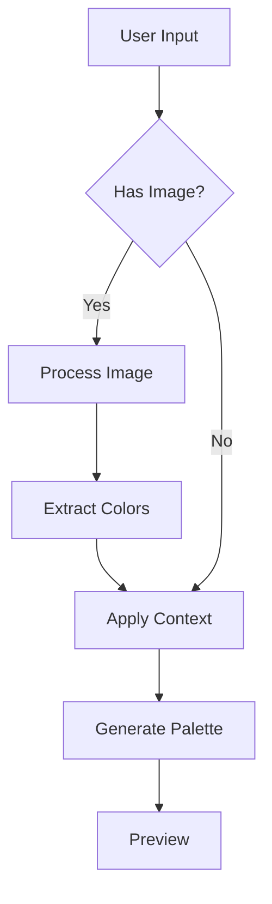

**Description**
Enhance the color palette generator UI to collect comprehensive business and design context for AI-driven color generation, including image-based generation with context.

**Current State**
Basic form in `templates/admin-page.php` has:
- Industry selection
- First impression input
Missing many important context factors needed for optimal AI generation.

**Required UI Elements**

**Core Features**

1. User Questions (Highest Priority)
   - Open-ended business description
   - Target audience insights
   - Desired mood/emotional impact

These questions form the foundation of our AI-driven color generation:
- Business context helps understand brand values and positioning
- Target audience insights inform color psychology choices
- Mood/emotional impact guides overall palette direction

Note: the plugin will ensure that the AI-generated palette meets WCAG color contrast compliance

2. Image Upload Section (New)
   - Website screenshot upload
   - Inspiration photo upload
   - Image context options:
     - "Extract exact colors" (basic color extraction)
     - "Enhance for web" (AI adjusts colors for optimal web usage)
     - "Match style but improve" (AI creates new palette inspired by image)
   - Image processing options (let AI handle):
     - White balance correction
     - Exposure adjustment
     - Contrast enhancement

3. Business Context Section
   - Industry (existing)
   - Business size/stage
   - Target market location
   - Competitive positioning
   - Brand values (multiple selection)
   - Business goals

4. Target Audience Section
   - Age range
   - Gender distribution
   - Income level
   - Education level
   - Cultural background
   - Tech-savviness

5. Brand Personality Section
   - Brand voice (formal to casual slider)
   - Key personality traits
   - Emotional associations
   - Brand archetype selection

6. Visual Preferences
   - Preferred color families
   - Style preferences (modern, traditional, etc.)
   - Inspiration sources
   - Existing brand colors (if any)

7. Technical Requirements
   - Accessibility level (WCAG AA/AAA)
   - Platform/medium (web, print, both)
   - Dark mode support
   - Color count preference

8. Cultural Considerations
   - Target markets/regions
   - Cultural color meanings
   - Religious considerations
   - Seasonal relevance

**Implementation Details**

1. Form Structure:
```html
<form id="gl-color-palette-form">
    <!-- User Questions -->
    <section class="gl-section user-questions">
        <!-- Open-ended business description -->
        <div class="gl-field business-description">...</div>
        <!-- Target audience insights -->
        <div class="gl-field target-audience">...</div>
        <!-- Desired mood/emotional impact -->
        <div class="gl-field mood-impact">...</div>
    </section>

    <!-- Image Upload -->
    <section class="gl-section image-upload">
        <div class="gl-field screenshot-upload">
            <label>Website Screenshot or Inspiration Photo</label>
            <input type="file" accept="image/*" />
            <select class="image-context">
                <option value="extract">Extract exact colors</option>
                <option value="enhance">Enhance for web</option>
                <option value="inspire">Match style but improve</option>
            </select>
            <div class="image-processing-options">
                <label><input type="checkbox" checked> Auto white balance</label>
                <label><input type="checkbox" checked> Auto exposure</label>
                <label><input type="checkbox" checked> Enhance contrast</label>
            </div>
        </div>
    </section>

    <!-- Business Context -->
    <section class="gl-section business-context">
        <!-- Existing industry field -->
        <div class="gl-field business-stage">...</div>
        <div class="gl-field target-market">...</div>
        <div class="gl-field brand-values">...</div>
    </section>

    <!-- Target Audience -->
    <section class="gl-section audience">...</section>

    <!-- Brand Personality -->
    <section class="gl-section personality">...</section>

    <!-- Visual Preferences -->
    <section class="gl-section visuals">...</section>

    <!-- Technical Requirements -->
    <section class="gl-section technical">...</section>

    <!-- Cultural Considerations -->
    <section class="gl-section cultural">...</section>
</form>
```

2. JavaScript Enhancements:
- Dynamic form fields based on generation method
- Image preview and basic analysis
- Real-time validation
- Accessibility checks

3. Processing Flow:


**Notes**
- All user input enhances AI understanding, whether using images or not
- Image processing is optional but can improve results
- Business context always guides final palette decisions
